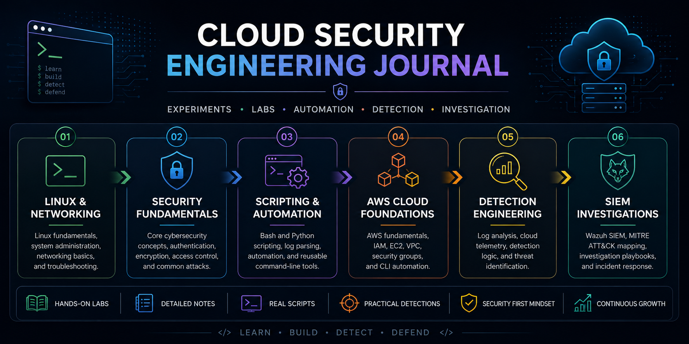

<p align="center">
  
</p>

<h1 align="center">Cloud Security Engineering Journal</h1>

<p align="center">
A structured, hands-on knowledge base documenting the progression from Linux fundamentals to cloud detection engineering through experiments, labs, scripting, AWS, and a self-hosted SIEM.
</p>

<p align="center">


</p>

---

## Overview

This repository is the engineering journal behind my cloud security portfolio.

Rather than serving as a collection of certificates or tutorial notes, it documents the technical progression of building cloud security skills through structured experimentation, practical labs, scripting, cloud infrastructure, detection engineering, and incident investigation.

The objective is to understand not only **how** technologies work, but also **how they integrate** into modern cloud security workflows.

Topics are explored through:

- Hands-on laboratories
- Technical notes
- Small utilities and scripts
- Troubleshooting sessions
- Investigation playbooks
- Lessons learned from failures

Unlike my implementation repositories—which focus on completed projects—this repository preserves the engineering process that made those projects possible.

---

# Learning Roadmap

```
Linux & Networking
        │
        ▼
Security Fundamentals
        │
        ▼
Bash & Python Automation
        │
        ▼
AWS Cloud Infrastructure
        │
        ▼
Cloud Detection Engineering
        │
        ▼
SIEM Investigation & Response
```

---

# Highlights

- ✅ Structured six-phase roadmap
- ✅ Linux administration
- ✅ Networking fundamentals
- ✅ Core cybersecurity concepts
- ✅ Bash scripting
- ✅ Python automation
- ✅ AWS CLI
- ✅ Cloud infrastructure
- ✅ Detection engineering
- ✅ Wazuh SIEM
- ✅ MITRE ATT&CK mapping
- ✅ Investigation playbooks
- ✅ Lessons learned & troubleshooting

---

# Repository Structure

```text
.
├── assets/
│   └── banner.png
│
├── 01-linux-networking
│   ├── labs.md
│   ├── notes.md
│   └── summary.md
│
├── 02-security-fundamentals
│   ├── labs.md
│   ├── notes.md
│   └── summary.md
│
├── 03-scripting-automation
│   ├── hero.sh
│   ├── log_check.sh
│   ├── log_parser.py
│   ├── labs.md
│   ├── notes.md
│   └── summary.md
│
├── 04-cloud-foundations
│   ├── inventory.sh
│   ├── labs.md
│   ├── notes.md
│   └── summary.md
│
├── 05-detection-engineering
│   ├── labs.md
│   ├── notes.md
│   └── summary.md
│
└── 06-siem-investigations
    ├── ssh-brute-force-playbook.md
    ├── labs.md
    ├── notes.md
    └── summary.md
```

---

# Phase Breakdown

| Phase | Focus |
|---------|------|
| **01** | Linux command line, filesystem, users, permissions, package management, networking |
| **02** | Core cybersecurity concepts, authentication, encryption, access control, common attacks |
| **03** | Bash automation, Python utilities, log parsing, reusable scripting |
| **04** | AWS fundamentals, IAM, EC2, VPC, AWS CLI automation |
| **05** | Detection engineering, log analysis, cloud telemetry, detection logic |
| **06** | SIEM investigations, Wazuh, MITRE ATT&CK mapping, incident response workflows |

---

# Engineering Methodology

Every phase follows the same documentation pattern.

| File | Purpose |
|------|---------|
| **notes.md** | Concepts, observations, troubleshooting, and technical references |
| **labs.md** | Practical exercises, experiments, and validation steps |
| **summary.md** | Key takeaways, mistakes, and lessons learned |

As the roadmap progresses, phases also introduce supporting scripts and investigation playbooks.

---

# Technologies

### Operating Systems

- Linux
- Fedora
- Ubuntu Server

### Networking

- TCP/IP
- DNS
- SSH
- Routing
- Firewalls

### Programming & Automation

- Bash
- Python
- AWS CLI

### Cloud

- AWS
- IAM
- EC2
- VPC
- Security Groups
- CloudTrail

### Detection Engineering

- Wazuh
- MITRE ATT&CK
- Detection Rules
- Log Analysis
- Active Response
- Incident Investigation

---

# Engineering Principles

This journal intentionally documents more than successful outcomes.

It captures:

- experiments that succeeded
- experiments that failed
- debugging sessions
- operational notes
- design decisions
- investigation methodology
- implementation trade-offs

The emphasis is on understanding systems rather than reproducing commands.

---

# Related Projects

The knowledge documented here directly supports the implementation of the following repositories.

| Repository | Description |
|------------|-------------|
| **aws-infra-cli** | AWS infrastructure provisioning using Bash and AWS CLI |
| **aws-secure-vpc-with-terraform** | Production-style AWS networking with Terraform |
| **aws-cloud-detection-pipeline** | Cloud detection engineering using CloudTrail, VPC Flow Logs, and Wazuh |
| **wazuh-custom-rule-detection** | Custom detection rules mapped to MITRE ATT&CK |
| **wazuh-active-response-containment** | Detection → Alert → Containment → Recovery workflow |

---

# Why This Repository Exists

Engineering knowledge compounds through experimentation, documentation, and iteration.

This repository preserves that process—capturing the progression from foundational Linux concepts to cloud detection engineering, one experiment, one investigation, and one project at a time.
